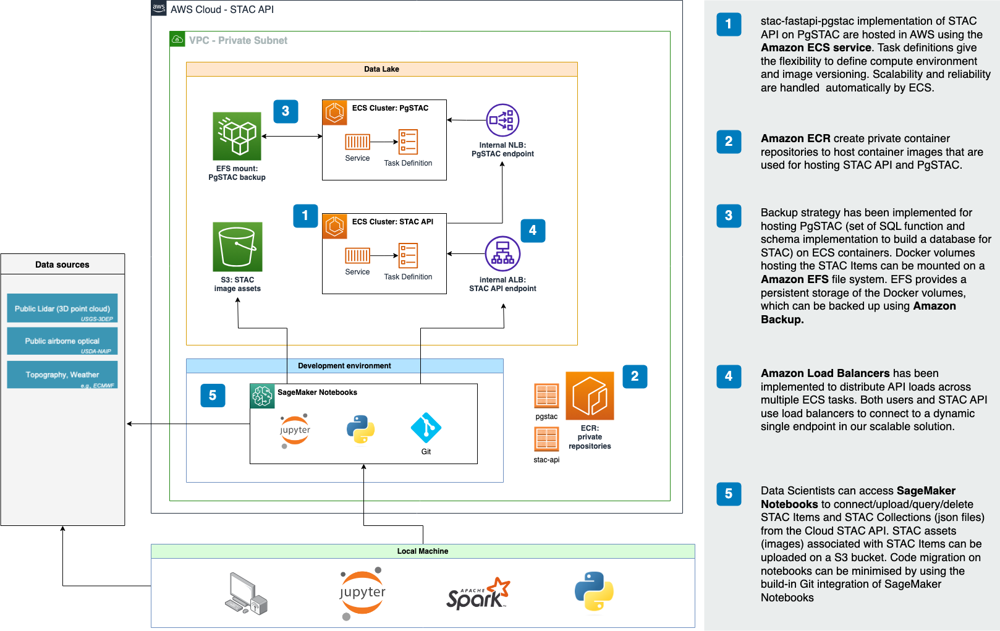
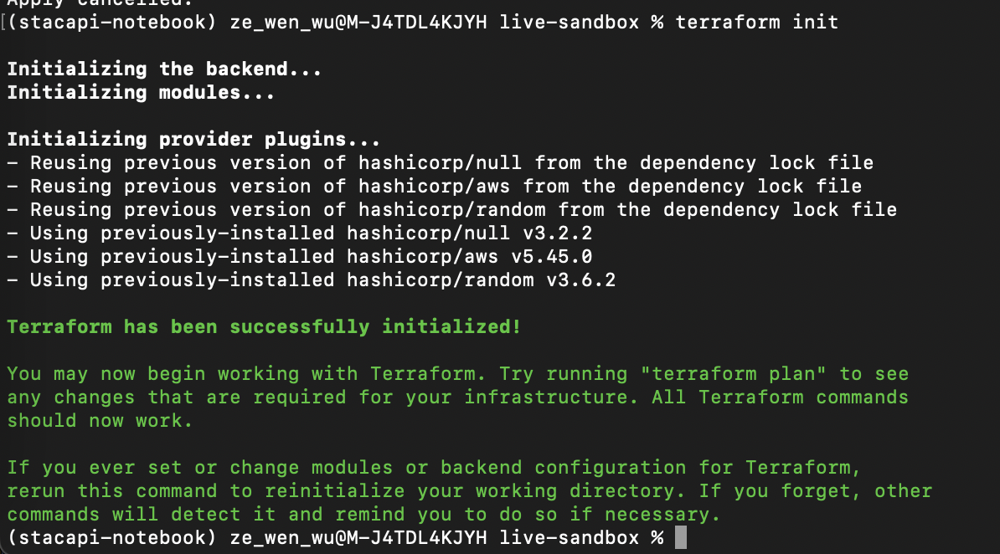
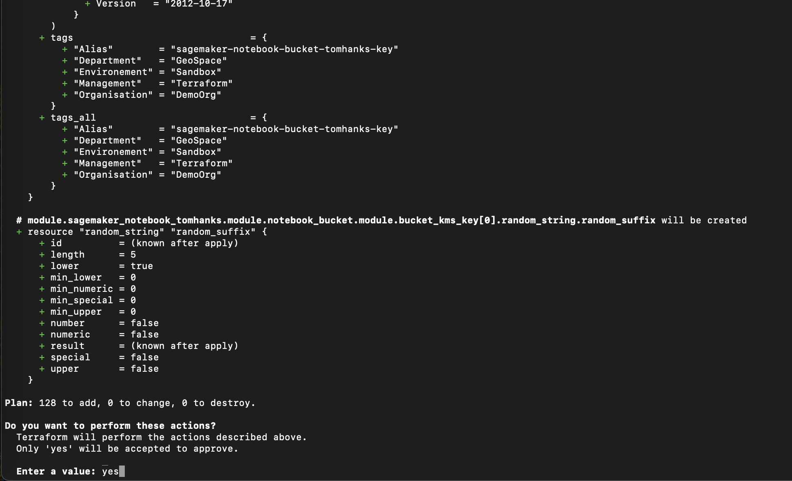
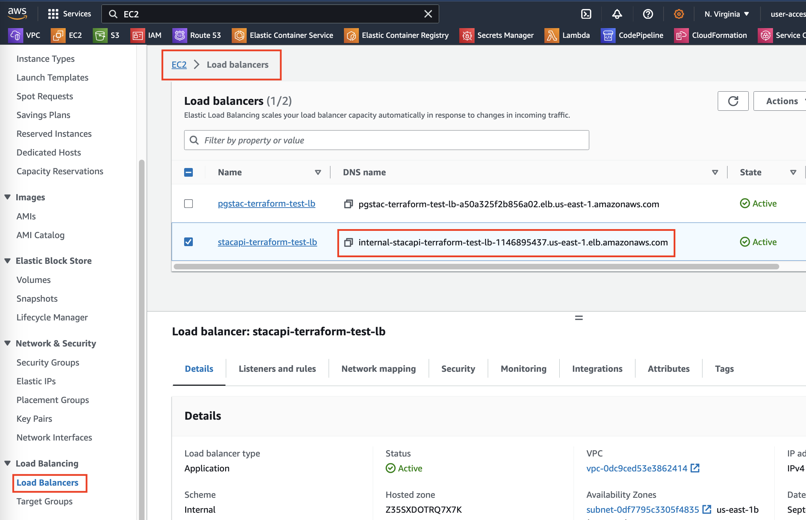
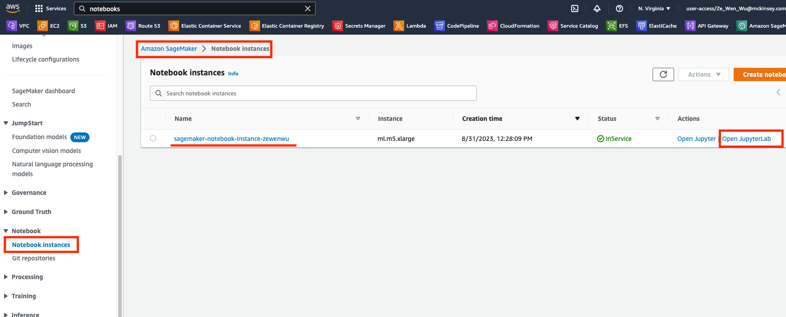
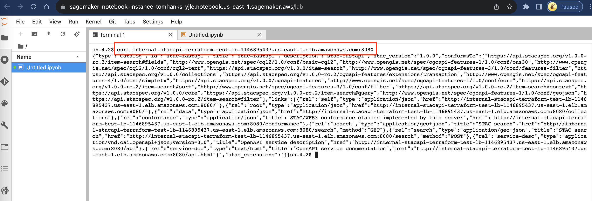
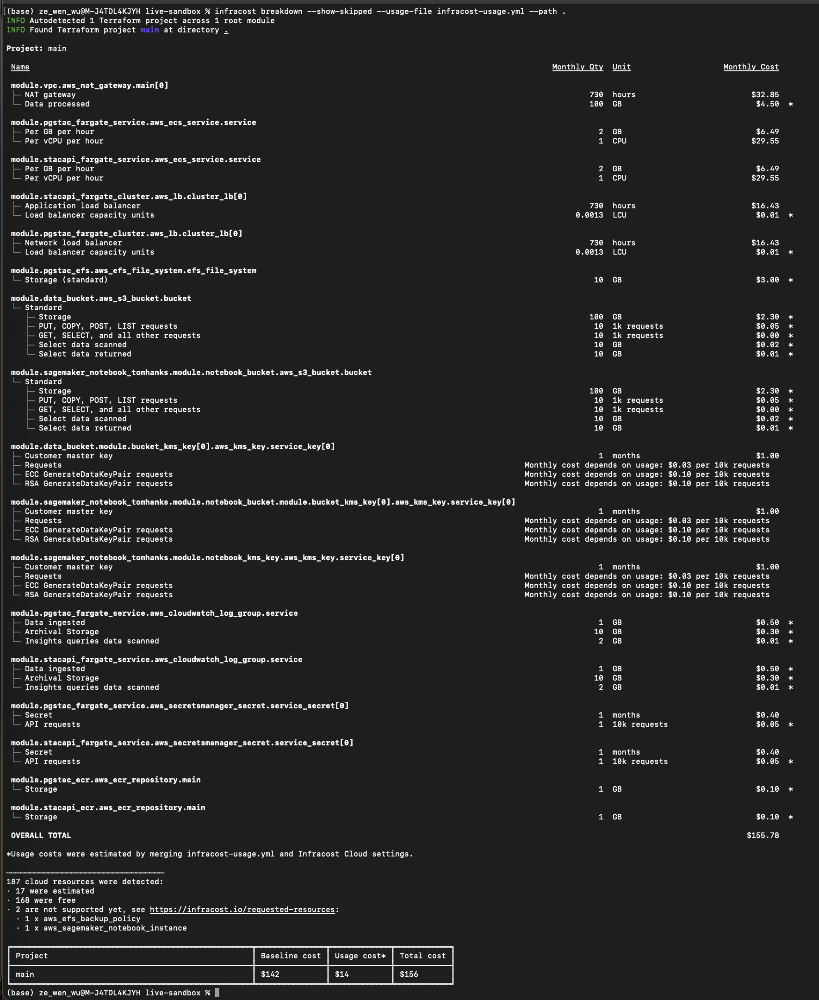

# STAC API - AWS Cloud Deployment DEMO

## Introduction

_[stac-fastapi-pgstac](https://github.com/stac-utils/stac-fastapi-pgstac) is an HTTP interface built in FastAPI. It validates requests and data sent to a PgSTAC backend, and adds links to the returned data. All other processing and search is provided directly using PgSTAC procedural sql / plpgsql functions on the database. PgSTAC stores all collection and item records as jsonb fields exactly as they come in allowing for any custom fields to be stored and retrieved transparently._

**This repository contains assets to help create a CLOUD STAC API using [stac-fastapi-pgstac](https://github.com/stac-utils/stac-fastapi-pgstac) for production purposes using AWS ECS.**

Deploying a STAC API in the cloud allows you to store and manage STAC assets such as STAC Items and STAC Collections in a cloud environment. This allows you:
- Host intermediary STAC Items which might be confidential, sensitive, or proprietary.
- Share the private STAC API with anyone by sharing access to the AWS account where the STAC API is deployed.
- Uploaded STAC Items will persist and will be regularly backed up in AWS, ensuring data integrity and availability.
- Complete possibility to scale the STAC API based on performance requirements, not limited to local compute resources.

The solution architecture to deploy using Terraform is as follows:



## Terraform Blueprints/Components

We use Terraform to automatically deploy the solution architecture. The Terraform blueprints are located in the `src/platform/live-sandbox` folder. **The Terraform blueprints are Terraform use-case specific files that references Terraform components.** For our use case, we reference Terraform components to deploy the STAC API in AWS.

Terraform components are located in the `src/platform/terraform-components` folder. **The Terraform components are reusable Terraform code that can be used to deploy a specific AWS resource.** Terraform components not only deploys its specific AWS resource, but deploys them considering best practices regarding reusability, security, and scalability.

For more info on Terraform, please refer to the [Terraform documentation](https://www.terraform.io/docs/language/index.html).

## Tutorial

Please follow the below tutorials to deploy the solution architecture using Terraform:

1. Set up Terraform with AWS Cloud account
2. Deploy our AWS infrastructure
3. Connect to Cloud STAC API using Amazon SageMaker Notebook

### 1. Set up Terraform with AWS Cloud account

The following tools are required to deploy the solution architecture using Terraform. Please ensure you have the following tools available on your local machine:

- [AWS account](https://aws.amazon.com/): You need to have an AWS account to deploy resources on AWS.
- [Terraform](https://learn.hashicorp.com/tutorials/terraform/install-cli): You need to have Terraform installed on your local machine to deploy the Terraform blueprints.
- [Docker](https://docs.docker.com/get-docker/): You need to have Docker installed on your local machine to pull and push Docker images to Amazon ECR, using Terrform.

Follow the below steps to configure local Terraform with your AWS account:

**Step 1.** Configure Terraform to use your AWS access key, secret key, and session token by copy-pasting your AWS access and secret key in a Terminal:

```bash
export AWS_ACCESS_KEY_ID="xxx"
export AWS_SECRET_ACCESS_KEY="xxx"
export AWS_SESSION_TOKEN="xxx"
```

**Step 2.** Change directory to `live-sandbox` that contains Terraform blueprints. Setup up and validate the Terraform blueprints by running the below commands:

```bash
cd src/platform/live-sandbox
terraform init
terraform validate
```



> **Remark:** In a multi-engineer environment, it is recommended to store Terraform state files in a remote backend, such as AWS S3, to allow multiple engineers to work on the same Terraform codebase. For more info on Terraform backends, please refer to the [Terraform documentation](https://www.terraform.io/docs/language/settings/backends/index.html).

### 2. Deploy our AWS infrastructure

To deploy above solution architecture using Terraform,

**Step 1.** Change directory to `live-sandbox` that contains Terraform blueprints to deploy the solution architecture by running the below commands:

```bash
cd src/platform/live-sandbox
terraform apply
```

**Step 2.** Confirm the Terraform resources to deploy in your AWS account, confirm by typing `yes` in the Terminal.



### 3. Connect to Cloud STAC API using Amazon SageMaker Notebook.

To test connectivity to the Cloud STAC API using Amazon SageMaker Notebook,

**Step 1.** Find the Application Load Balancer DNS endpoint of the STAC API service in the AWS Console.



**Step 2.** Open the JupyterLab interface of the Amazon SageMaker Notebook instance in the AWS Console.



**Step 3.** Open a new Terminal in the JupyterLab interface and use the following command to check if the STAC API is running.

```bash
curl http://<STACAPI_DNS_ENDPOINT>:8080/
```


**CONGRATULATIONS! You have successfully deployed a Cloud STAC API using Terraform in AWS ECS.**

For a tutorial on working with PySTAC and the STAC API in SageMaker Notebooks, please refer to the [STAC API tutorial](src/notebooks/stac-api-demo.ipynb).

#### Destroy the AWS infrastructure

To destroy the AWS infrastructure deployed using Terraform, run the below command:

```bash
terraform destroy
```

Confirm the Terraform resources to destroy in your AWS account, confirm by typing `yes` in the Terminal.

## Cost Estimation

The cost estimation of the solution architecture is based on the AWS services used in the solution architecture. The cost estimation is based using **Infracost**, a cost estimation tool that estimates the cost of Terraform resources before deployment.

To estimate the cost of the solution architecture before deployment, follow the below steps:

**Step 1.** Install Infracost and obtain an API key by following the instructions in the [Infracost documentation](https://www.infracost.io/docs/).

**Step 2.** Change directory to `live-sandbox` that contains Terraform blueprints. Run the below command to estimate the cost of the solution architecture:

```bash
cd src/platform/live-sandbox
infracost breakdown --show-skipped --usage-file infracost-usage.yml --path .
```

> **Remark**: The command uses the `infracost-usage.yml` file to estimate the usage costs of the solution architecture, which has been estimated carefully, but not guaranteed to be accurate.

The cost estimation of the solution architecture is displayed in the Terminal:



## Troubleshooting

None so far.
