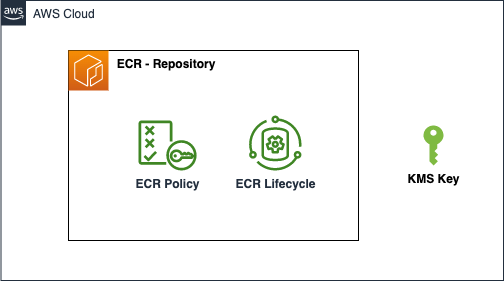

# AWS ECR repository

Amazon Elastic Container Registry (ECR) is a fully-managed Docker container registry that makes it easy for developers to store, manage, and deploy Docker container images. This component creates an ECR repository that is used to store Docker images.

This module creates:

- **ECR repository**: Resource to store, deploy and manage docker container images
- **ECR Repository Policy**: Policy document for allowing cross account push and pull accesses.
- **ECR Lifecycle Policy**: Policy document for managing the lifecycle of images in the repository.
- **KMS Key**: Optional, KMS key for encrypting images in the repository.
- **Automatic public Docker image push**: The module will automatically push a public Docker image to the ECR repository if provided.

## Architecture



## Implementation decisions

### ECR Image

The ECR module allows you to specify an optional public image. If provided, the module will automatically pull the image from the internet using the local Docker setup and push it to the ECR repository. 

This is useful for prepopulating the ECR repository with a public image.

### ECR Repository Resource Policy

The ECR repository resource policy is created with the following policies:
  - AllowPushECR: Reading the created lambda secret from secret manager, only for the provided push access principal ARNs.
  - AllowPullECR: Permissions for reading the images from the repository, only for the provided pull access principal ARNs.

### ECR Lifecycle Policy

The ECR lifecycle policy is created with the following policies. Expire images based on the provided Expire Type:
  - Expire Type: The type of expiry rule (age or count).
  - Count: 
    - If Expire Type is age, this is the number of days to keep the images in the repository
    - If Expire Type is count, this is the number of images to keep in the repository.

### KMS Key (Optional)

A KMS key can be created together with the ECR repository. The KMS key is used to encrypt the images in the repository.

## How to use this module

```terraform
module "ecr_repository" {
  source = "./local/path/to/this/module"
  
  repository_name            = var.repository_name
  
  pull_access_principal_arns = []
  push_access_principal_arns = []

  image_expiry_rule          = {
    expire_type = "age"
    count       = 30
  }
  
  public_docker_image = "ghcr.io/stac-utils/stac-fastapi-pgstac:v2.4.10" # Optional
  is_immutable_image   = true      # Optional
  tags                 = var.tags  # Optional

}
```

<!-- BEGIN_TF_DOCS -->
## Requirements

| Name | Version |
|------|---------|
| <a name="requirement_terraform"></a> [terraform](#requirement\_terraform) | >= 1.1.3 |
| <a name="requirement_aws"></a> [aws](#requirement\_aws) | ~> 5.45.0 |
| <a name="requirement_null"></a> [null](#requirement\_null) | >= 3.1.0 |

## Providers

| Name | Version |
|------|---------|
| <a name="provider_aws"></a> [aws](#provider\_aws) | ~> 5.45.0 |
| <a name="provider_null"></a> [null](#provider\_null) | >= 3.1.0 |

## Modules

| Name | Source | Version |
|------|--------|---------|
| <a name="module_ecr_kms_key"></a> [ecr\_kms\_key](#module\_ecr\_kms\_key) | ../aws-kmskey | n/a |

## Resources

| Name | Type |
|------|------|
| [aws_ecr_lifecycle_policy.ecr_lifecycle_age](https://registry.terraform.io/providers/hashicorp/aws/latest/docs/resources/ecr_lifecycle_policy) | resource |
| [aws_ecr_lifecycle_policy.ecr_lifecycle_count](https://registry.terraform.io/providers/hashicorp/aws/latest/docs/resources/ecr_lifecycle_policy) | resource |
| [aws_ecr_repository.main](https://registry.terraform.io/providers/hashicorp/aws/latest/docs/resources/ecr_repository) | resource |
| [aws_ecr_repository_policy.allow_access](https://registry.terraform.io/providers/hashicorp/aws/latest/docs/resources/ecr_repository_policy) | resource |
| [null_resource.docker_pull_push](https://registry.terraform.io/providers/hashicorp/null/latest/docs/resources/resource) | resource |
| [aws_caller_identity.active](https://registry.terraform.io/providers/hashicorp/aws/latest/docs/data-sources/caller_identity) | data source |
| [aws_iam_policy_document.repository_policy](https://registry.terraform.io/providers/hashicorp/aws/latest/docs/data-sources/iam_policy_document) | data source |
| [aws_region.active](https://registry.terraform.io/providers/hashicorp/aws/latest/docs/data-sources/region) | data source |

## Inputs

| Name | Description | Type | Default | Required |
|------|-------------|------|---------|:--------:|
| <a name="input_enable_kms_encryption"></a> [enable\_kms\_encryption](#input\_enable\_kms\_encryption) | Set to true to enable KMS encryption for the ECR repository | `bool` | `false` | no |
| <a name="input_image_expiry_rule"></a> [image\_expiry\_rule](#input\_image\_expiry\_rule) | Set image expiry config to garbage collect old images. Consider pricing, service limits while setting the limit. Set expire\_type is by `count` or by `age`. | <pre>object({<br>    expire_type = string # By Age or Count<br>    count       = number # days count or image count<br>  })</pre> | n/a | yes |
| <a name="input_is_immutable_image"></a> [is\_immutable\_image](#input\_is\_immutable\_image) | Set to true to enable immutable image. `latest` tag will not work for immutable images, refer AWS documentation and Readme for further details. | `bool` | `true` | no |
| <a name="input_public_docker_image"></a> [public\_docker\_image](#input\_public\_docker\_image) | [Optional] The url of the public Docker image to pull from the internet and push to the ECR repository. If empty, the ECR will have no prepopulated image. | `string` | `""` | no |
| <a name="input_pull_access_principal_arns"></a> [pull\_access\_principal\_arns](#input\_pull\_access\_principal\_arns) | Principals to set to the repository policy to gain Pull access to the repo | `list(string)` | n/a | yes |
| <a name="input_push_access_principal_arns"></a> [push\_access\_principal\_arns](#input\_push\_access\_principal\_arns) | Principals to set to the repository policy to gain Push access to the repo | `list(string)` | n/a | yes |
| <a name="input_repository_force_delete"></a> [repository\_force\_delete](#input\_repository\_force\_delete) | If set to true, the ECR repository will be deleted even if it contains images | `bool` | `false` | no |
| <a name="input_repository_name"></a> [repository\_name](#input\_repository\_name) | Name to give to the ECR repository | `string` | n/a | yes |
| <a name="input_tags"></a> [tags](#input\_tags) | Custom tags which can be passed on to the AWS resources. They should be key value pairs having distinct keys | `map(any)` | `{}` | no |

## Outputs

| Name | Description |
|------|-------------|
| <a name="output_repository_arn"></a> [repository\_arn](#output\_repository\_arn) | URL for the ecr repository |
| <a name="output_repository_kms_key_arn"></a> [repository\_kms\_key\_arn](#output\_repository\_kms\_key\_arn) | The Amazon Resource Name (ARN) of the KMS key used for the ECR repository. |
| <a name="output_repository_kms_key_id"></a> [repository\_kms\_key\_id](#output\_repository\_kms\_key\_id) | The ID of the KMS key used for the ECR repository. |
| <a name="output_repository_name"></a> [repository\_name](#output\_repository\_name) | Name of the ecr repository |
| <a name="output_repository_url"></a> [repository\_url](#output\_repository\_url) | URL for the ecr repository |
<!-- END_TF_DOCS -->
