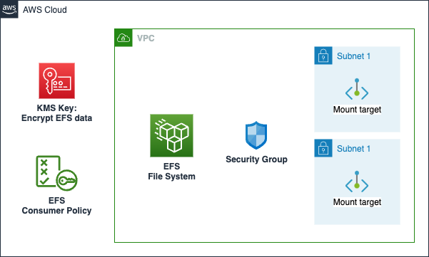

# AWS Elastic File System

Amazon Elastic File System is a cloud storage service provided by Amazon Web Services designed to provide scalable, elastic, concurrent with some restrictions, and encrypted file storage for use with both AWS cloud services and on-premises resources.

This module creates:

- **Elastic File System (EFS) File System**
- **EFS Mount Targets**: Provides and controls network access to Amazon EFS file systems.
- **EFS Security Group**: Controls inbound and outbound traffic to the EFS file system.
- **EFS KMS Key**: Optional, Creates a KMS key for the EFS file system.
- **EFS Backup Policy**: Turns automatic backups on or off for an existing file system.
- **EFS Consumer Policy**: A policy that can be added to an IAM role which allows the role to access the EFS file system.

## Architecture



## Implementation decisions

### KMS Key

This module allows you to specify whether to create a KMS key for the EFS file system. If enabled, the module will automatically create a KMS key and associate it with the EFS file system.

## How to use this module

```terraform
module "example_efs" {
  source = "path/to/this/module/aws-efs"

  efs_info = {
    name            = "test-efs"
    throughput_mode = "bursting"
  }

  allowed_actions = [
    "elasticfilesystem:ClientMount",
    "elasticfilesystem:ClientWrite",
    "elasticfilesystem:ClientRootAccess",
  ]

  network_info = {
    vpc_id     = module.vpc.vpc_id
    subnet_ids = module.vpc.private_subnets_ids.workbench
  }
  allow_additional_sg_ingress_ids = []

  backup_policy_status = "ENABLED"

  tags = local.tags
}
```

<!-- BEGIN_TF_DOCS -->
## Requirements

| Name | Version |
|------|---------|
| <a name="requirement_terraform"></a> [terraform](#requirement\_terraform) | >= 1.1.3 |
| <a name="requirement_aws"></a> [aws](#requirement\_aws) | ~> 5.45.0 |

## Providers

| Name | Version |
|------|---------|
| <a name="provider_aws"></a> [aws](#provider\_aws) | ~> 5.45.0 |

## Modules

| Name | Source | Version |
|------|--------|---------|
| <a name="module_efs_kms_key"></a> [efs\_kms\_key](#module\_efs\_kms\_key) | ../aws-kmskey | n/a |
| <a name="module_efs_sg"></a> [efs\_sg](#module\_efs\_sg) | ../aws-sg | n/a |

## Resources

| Name | Type |
|------|------|
| [aws_efs_backup_policy.policy](https://registry.terraform.io/providers/hashicorp/aws/latest/docs/resources/efs_backup_policy) | resource |
| [aws_efs_file_system.efs_file_system](https://registry.terraform.io/providers/hashicorp/aws/latest/docs/resources/efs_file_system) | resource |
| [aws_efs_mount_target.efs_mount_target](https://registry.terraform.io/providers/hashicorp/aws/latest/docs/resources/efs_mount_target) | resource |
| [aws_iam_policy.consumer](https://registry.terraform.io/providers/hashicorp/aws/latest/docs/resources/iam_policy) | resource |
| [aws_caller_identity.active](https://registry.terraform.io/providers/hashicorp/aws/latest/docs/data-sources/caller_identity) | data source |
| [aws_iam_policy_document.consumer](https://registry.terraform.io/providers/hashicorp/aws/latest/docs/data-sources/iam_policy_document) | data source |
| [aws_region.active](https://registry.terraform.io/providers/hashicorp/aws/latest/docs/data-sources/region) | data source |

## Inputs

| Name | Description | Type | Default | Required |
|------|-------------|------|---------|:--------:|
| <a name="input_allow_additional_sg_ingress_ids"></a> [allow\_additional\_sg\_ingress\_ids](#input\_allow\_additional\_sg\_ingress\_ids) | Additional Security Group IDs to allow ingress traffic from | `list(string)` | `[]` | no |
| <a name="input_allowed_actions"></a> [allowed\_actions](#input\_allowed\_actions) | List of EFS actions which are allowed for same account principals for the consumer policy | `list(string)` | <pre>[<br>  "elasticfilesystem:ClientMount",<br>  "elasticfilesystem:ClientWrite",<br>  "elasticfilesystem:ClientRootAccess"<br>]</pre> | no |
| <a name="input_backup_policy_status"></a> [backup\_policy\_status](#input\_backup\_policy\_status) | (optional) EFS Backup Policy Status | `string` | `"ENABLED"` | no |
| <a name="input_efs_info"></a> [efs\_info](#input\_efs\_info) | The info block for the EFS File System.<br>The throughput\_mode is either bursting, elastic, or provisioned.<br>If throughput\_mode is provisioned, throughput\_mibps must be set. | <pre>object({<br>    name             = string<br>    throughput_mode  = string<br>    throughput_mibps = optional(number)<br>  })</pre> | <pre>{<br>  "name": "test-efs",<br>  "throughput_mode": "bursting"<br>}</pre> | no |
| <a name="input_enable_kms_encryption"></a> [enable\_kms\_encryption](#input\_enable\_kms\_encryption) | Enable KMS Encryption for EFS | `bool` | `false` | no |
| <a name="input_network_info"></a> [network\_info](#input\_network\_info) | Network information for the EFS File System NFSv4 endpoint | <pre>object({<br>    vpc_id     = string<br>    subnet_ids = list(string)<br>  })</pre> | n/a | yes |
| <a name="input_tags"></a> [tags](#input\_tags) | Custom tags which can be passed on to the AWS resources. They should be key value pairs having distinct keys | `map(string)` | `{}` | no |

## Outputs

| Name | Description |
|------|-------------|
| <a name="output_consumer_policy_arn"></a> [consumer\_policy\_arn](#output\_consumer\_policy\_arn) | The Amazon Resource Name (ARN) of the IAM policy for the consumer. |
| <a name="output_consumer_policy_id"></a> [consumer\_policy\_id](#output\_consumer\_policy\_id) | The ID of the IAM policy for the consumer. |
| <a name="output_efs_file_system_arn"></a> [efs\_file\_system\_arn](#output\_efs\_file\_system\_arn) | EFS File System ARN |
| <a name="output_efs_file_system_id"></a> [efs\_file\_system\_id](#output\_efs\_file\_system\_id) | EFS File System ID |
| <a name="output_efs_file_system_name"></a> [efs\_file\_system\_name](#output\_efs\_file\_system\_name) | EFS File System Name |
| <a name="output_efs_file_system_security_group_id"></a> [efs\_file\_system\_security\_group\_id](#output\_efs\_file\_system\_security\_group\_id) | EFS File System Security Group ID |
| <a name="output_efs_kms_key_arn"></a> [efs\_kms\_key\_arn](#output\_efs\_kms\_key\_arn) | EFS File System KMS Key ARN |
<!-- END_TF_DOCS -->

