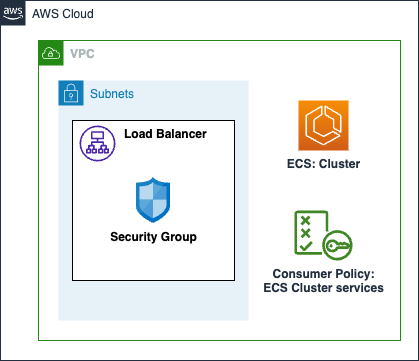

# AWS ECS Fargate Cluster

An Amazon Elastic Container Service (ECS) cluster is a logical grouping of tasks or services. Provisions a Fargate cluster with reasonable defaults for networking, certificate management, load balancing, service discovery, and security groups.

This module creates:

- **ECS Cluster**: ECS cluster is a logical grouping of tasks or services.
- **ECS Load Balancer**: Optional, Application or Network Load Balancer for ECS cluster.
- **ECS cluster consumer policy**: IAM role and policy for ECS cluster.

## Architecture



## How to use this module

```terraform
module "my_cluster" {
  source = "path/to/this/module/aws-fargate-cluster"

  cluster_name    = "my-cluster"
  network_info = {
    vpc_id     = "vpc-1234567890"
    subnet_ids = ["subnet-1234567890", "subnet-0987654321"]
  }

  create_lb             = true
  lb_listener_port      = 8080
  lb_type               = "application"
  lb_access_logs_bucket = ""
  internal_lb           = true

  allow_additional_sg_load_balancer_ingress_ids = [module.stacapi_fargate_service.service_security_group_id]

  tags = local.tags
}
```

<!-- BEGIN_TF_DOCS -->
## Requirements

| Name | Version |
|------|---------|
| <a name="requirement_terraform"></a> [terraform](#requirement\_terraform) | >= 1.1.3 |
| <a name="requirement_aws"></a> [aws](#requirement\_aws) | ~> 5.45.0 |

## Providers

| Name | Version |
|------|---------|
| <a name="provider_aws"></a> [aws](#provider\_aws) | ~> 5.45.0 |

## Modules

| Name | Source | Version |
|------|--------|---------|
| <a name="module_cluster_lb_sg"></a> [cluster\_lb\_sg](#module\_cluster\_lb\_sg) | ../aws-sg | n/a |

## Resources

| Name | Type |
|------|------|
| [aws_ecs_cluster.cluster](https://registry.terraform.io/providers/hashicorp/aws/latest/docs/resources/ecs_cluster) | resource |
| [aws_iam_policy.consumer](https://registry.terraform.io/providers/hashicorp/aws/latest/docs/resources/iam_policy) | resource |
| [aws_lb.cluster_lb](https://registry.terraform.io/providers/hashicorp/aws/latest/docs/resources/lb) | resource |
| [aws_caller_identity.current](https://registry.terraform.io/providers/hashicorp/aws/latest/docs/data-sources/caller_identity) | data source |
| [aws_iam_policy_document.consumer](https://registry.terraform.io/providers/hashicorp/aws/latest/docs/data-sources/iam_policy_document) | data source |

## Inputs

| Name | Description | Type | Default | Required |
|------|-------------|------|---------|:--------:|
| <a name="input_allow_additional_sg_load_balancer_ingress_ids"></a> [allow\_additional\_sg\_load\_balancer\_ingress\_ids](#input\_allow\_additional\_sg\_load\_balancer\_ingress\_ids) | Additional Security Group IDs to allow ingress traffic to the cluster load balancer | `list(string)` | `[]` | no |
| <a name="input_allowed_actions"></a> [allowed\_actions](#input\_allowed\_actions) | List of ECS actions which are allowed for same account principals for the consumer policy | `list(string)` | <pre>[<br>  "ecs:DescribeTaskDefinition",<br>  "ecs:RegisterTaskDefinition",<br>  "ecs:UpdateService",<br>  "ecs:RunTask"<br>]</pre> | no |
| <a name="input_cluster_name"></a> [cluster\_name](#input\_cluster\_name) | Name of the ECS cluster to create | `string` | n/a | yes |
| <a name="input_create_lb"></a> [create\_lb](#input\_create\_lb) | Create a load balancer for the cluster | `bool` | `false` | no |
| <a name="input_internal_lb"></a> [internal\_lb](#input\_internal\_lb) | (optional) Define whether to make internal or an internet-facing load balancer | `bool` | `true` | no |
| <a name="input_lb_access_logs_bucket"></a> [lb\_access\_logs\_bucket](#input\_lb\_access\_logs\_bucket) | AWS ALB Access Logs Bucket | `string` | `""` | no |
| <a name="input_lb_listener_port"></a> [lb\_listener\_port](#input\_lb\_listener\_port) | The port to listen on the ALB for public services (80/443, default 443) | `number` | `443` | no |
| <a name="input_lb_type"></a> [lb\_type](#input\_lb\_type) | The type of load balancer to create (application/network) | `string` | n/a | yes |
| <a name="input_network_info"></a> [network\_info](#input\_network\_info) | Network information for the ECS Cluster | <pre>object({<br>    vpc_id     = string<br>    subnet_ids = list(string)<br>  })</pre> | n/a | yes |
| <a name="input_tags"></a> [tags](#input\_tags) | Custom tags which can be passed on to the AWS resources. They should be key value pairs having distinct keys | `map(string)` | `{}` | no |

## Outputs

| Name | Description |
|------|-------------|
| <a name="output_consumer_policy_arn"></a> [consumer\_policy\_arn](#output\_consumer\_policy\_arn) | The ARN of the IAM policy for the consumer. |
| <a name="output_ecs_cluster"></a> [ecs\_cluster](#output\_ecs\_cluster) | ECS cluster details |
| <a name="output_lb_details"></a> [lb\_details](#output\_lb\_details) | Load Balancer details |
<!-- END_TF_DOCS -->