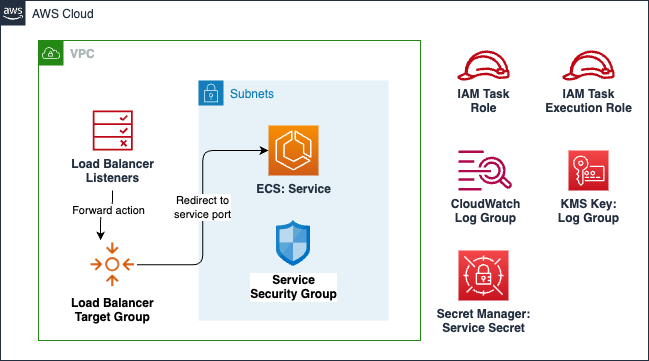

# AWS ECS Fargate Service

Amazon Elastic Container Service (Amazon ECS) is a fully managed container orchestration service that helps you to more efficiently deploy, manage, and scale containerized applications.

This module creates:

- **ECS Fargate Service**: Creates a public OR a private service based on whether it would be attached to a load balancer or not.
- **Log Group**: Log group in Cloudwatch where all the application logs are stored.
- **Log Group KMS Key**: Optional, KMS key for encrypting logs in Cloudwatch.
- **Task Role**: IAM role for ECS task.
- **Task Execution Role**: IAM role for ECS task execution.
- **Secret Manager Secret**: Secret Manager is used to store service secrets with encryption, using KMS key.
- **ECS Auto Scaling**: Optional, Auto scaling configuration for the service.
- **Load balancer target group**: Optional, Load balancer target group for the load balancer for the service.
- **Load balancer listener**: Optional, Load balancer listener for the load balancer connected the service.
- **EFS Mount**: Mounts an EFS volume to the service.

## Architecture



## Implementation decisions

### ECS Task Role

The ECS Task Role is an IAM role that is used by the ECS task to access other AWS services. This role is used to grant permissions to the ECS task to access other AWS services. The role is created with the following permissions:
- User-defined ECS Task Role policy arns can be passed as a map to attach to the ECS Task Role.

### ECS Task Execution Role

The ECS Task Execution Role is an IAM role that is used by the ECS task to pull container images and write logs to CloudWatch. This role is used to grant permissions to the ECS task to pull container images from ECR and write logs to CloudWatch. The role is created with the following permissions:
- AmazonECSTaskExecutionRolePolicy: Managed AWS IAM Policy, Grants the ECS task permissions to pull container images from ECR and write logs to CloudWatch.
- AmazonElasticFileSystemClientFullAccess: Managed AWS IAM Policy, Grants the ECS task permissions to access EFS.

### ECS Cloud Watch Log Group

The Cloud Watch Log Group is used to store the logs generated by the ECS task. The log group is created with the following properties:
- Retention in days: User-defined number of days to retain the logs in CloudWatch.
- Encryption: Optional, KMS key for encrypting logs in CloudWatch.

### ECS Load Balancer Listener and Target Group

The Load Balancer Listener and Target Group are used to route traffic to the ECS service. The listener and target group are created with the following properties:
- The listener is created based on the type of load balancer (application/network). If the load balancer is an application load balancer, the listener is created with a rule based on the host or path. If the load balancer is a network load balancer, the listener is created with a rule based on the TCP port. The listener will be attached to an user-defined load balancer.
- The target group is created with IP target type and an user-defined health check configuration.

### Secret Manager Secret

This module creates a Secrets Manager secret for each key/value in the `secrets` variable. The secret will contain a JSON string with the key/value pair.

The task definition of the ECS service will then pass the secret keys as environment variables to the container. The secret values will be referenced as Secret Manager ARNs, so the actual values of the secrets will never be exposed in the container.

The container will need to have the necessary permissions to access the secret values in Secret Manager. The task execution role created by this module will have the necessary permissions to access the secret values.

## How to use this module

```terraform
module "my_service" {
  source = "path/to/this/module/aws-fargate-service"

  ecs_cluster_name = "my-service"

  cpu           = "1024"
  memory        = "2048"
  service_count = 1
  service_image = module.pgstac_ecr.repository_url
  service_name  = "pgstac"
  service_port  = "5432"

  ecs_task_exec_role_policy_arns = {
    "efs_policy" = module.efs.consumer_policy_arn
  }
  ecs_task_role_policy_arns = {
    "rds_policy" = module.db.rds_policy_arn
  }

  network_info = {
    vpc_id     = "vpc-1234567890"
    subnet_ids = ["subnet-1234567890", "subnet-0987654321"]
  }
  allow_additional_sg_ingress_ids = ["sg-1234567890", "sg-0987654321"]

  enable_auto_scaling = false
  auto_scale_config   = null

  attach_lb = true
  lb_arn    = "arn:aws:elasticloadbalancing:us-east-1:1234567890:loadbalancer/app/my-alb/1234567890"
  lb_type   = "application"

  health_check = {
    interval            = 60
    timeout             = 30
    healthy_threshold   = 3
    unhealthy_threshold = 3
    path                = "/"
    matcher             = "200,201,204"
  }

  efs_volume_ids = {
    "pgstacEFSVolume" = "fs-1234"
  }

  efs_volume_mountpoints = {
    "pgstacEFSVolume" = "/var/lib/postgresql/data"
  }

  envvars = [
    {
      name  = "EXAMPLE_ENV"
      value = "example"
    }
  ]
  secrets = {
    "POSTGRES_PASSWORD" = local.postgres_pass
  }

  tags = local.tags
}
```

<!-- BEGIN_TF_DOCS -->
## Requirements

| Name | Version |
|------|---------|
| <a name="requirement_terraform"></a> [terraform](#requirement\_terraform) | >= 1.1.3 |
| <a name="requirement_aws"></a> [aws](#requirement\_aws) | ~> 5.45.0 |
| <a name="requirement_random"></a> [random](#requirement\_random) | >= 3.2.0 |

## Providers

| Name | Version |
|------|---------|
| <a name="provider_aws"></a> [aws](#provider\_aws) | ~> 5.45.0 |
| <a name="provider_random"></a> [random](#provider\_random) | >= 3.2.0 |

## Modules

| Name | Source | Version |
|------|--------|---------|
| <a name="module_cloudwatch_log_group_kms_key"></a> [cloudwatch\_log\_group\_kms\_key](#module\_cloudwatch\_log\_group\_kms\_key) | ../aws-kmskey | n/a |
| <a name="module_service_sg"></a> [service\_sg](#module\_service\_sg) | ../aws-sg | n/a |

## Resources

| Name | Type |
|------|------|
| [aws_appautoscaling_policy.ecs_target_cpu](https://registry.terraform.io/providers/hashicorp/aws/latest/docs/resources/appautoscaling_policy) | resource |
| [aws_appautoscaling_policy.ecs_target_memory](https://registry.terraform.io/providers/hashicorp/aws/latest/docs/resources/appautoscaling_policy) | resource |
| [aws_appautoscaling_target.ecs_target](https://registry.terraform.io/providers/hashicorp/aws/latest/docs/resources/appautoscaling_target) | resource |
| [aws_cloudwatch_log_group.service](https://registry.terraform.io/providers/hashicorp/aws/latest/docs/resources/cloudwatch_log_group) | resource |
| [aws_ecs_service.service](https://registry.terraform.io/providers/hashicorp/aws/latest/docs/resources/ecs_service) | resource |
| [aws_ecs_task_definition.service](https://registry.terraform.io/providers/hashicorp/aws/latest/docs/resources/ecs_task_definition) | resource |
| [aws_iam_policy.service_get_secret](https://registry.terraform.io/providers/hashicorp/aws/latest/docs/resources/iam_policy) | resource |
| [aws_iam_role.task_execution](https://registry.terraform.io/providers/hashicorp/aws/latest/docs/resources/iam_role) | resource |
| [aws_iam_role.task_role](https://registry.terraform.io/providers/hashicorp/aws/latest/docs/resources/iam_role) | resource |
| [aws_iam_role_policy_attachment.service_get_secret](https://registry.terraform.io/providers/hashicorp/aws/latest/docs/resources/iam_role_policy_attachment) | resource |
| [aws_iam_role_policy_attachment.task_execution](https://registry.terraform.io/providers/hashicorp/aws/latest/docs/resources/iam_role_policy_attachment) | resource |
| [aws_iam_role_policy_attachment.task_execution_additional](https://registry.terraform.io/providers/hashicorp/aws/latest/docs/resources/iam_role_policy_attachment) | resource |
| [aws_iam_role_policy_attachment.task_role_additional](https://registry.terraform.io/providers/hashicorp/aws/latest/docs/resources/iam_role_policy_attachment) | resource |
| [aws_lb_listener.alb_listener](https://registry.terraform.io/providers/hashicorp/aws/latest/docs/resources/lb_listener) | resource |
| [aws_lb_listener.nlb_listener](https://registry.terraform.io/providers/hashicorp/aws/latest/docs/resources/lb_listener) | resource |
| [aws_lb_listener_rule.alb_host_based_listener](https://registry.terraform.io/providers/hashicorp/aws/latest/docs/resources/lb_listener_rule) | resource |
| [aws_lb_listener_rule.alb_path_based_listener](https://registry.terraform.io/providers/hashicorp/aws/latest/docs/resources/lb_listener_rule) | resource |
| [aws_lb_target_group.service](https://registry.terraform.io/providers/hashicorp/aws/latest/docs/resources/lb_target_group) | resource |
| [aws_secretsmanager_secret.service_secret](https://registry.terraform.io/providers/hashicorp/aws/latest/docs/resources/secretsmanager_secret) | resource |
| [aws_secretsmanager_secret_version.service_secret](https://registry.terraform.io/providers/hashicorp/aws/latest/docs/resources/secretsmanager_secret_version) | resource |
| [random_string.service_secret_random_suffix](https://registry.terraform.io/providers/hashicorp/random/latest/docs/resources/string) | resource |
| [aws_caller_identity.active](https://registry.terraform.io/providers/hashicorp/aws/latest/docs/data-sources/caller_identity) | data source |
| [aws_iam_policy_document.service_get_secret](https://registry.terraform.io/providers/hashicorp/aws/latest/docs/data-sources/iam_policy_document) | data source |
| [aws_iam_policy_document.task_assume_role_policy](https://registry.terraform.io/providers/hashicorp/aws/latest/docs/data-sources/iam_policy_document) | data source |
| [aws_iam_policy_document.task_execution_assume_role_policy](https://registry.terraform.io/providers/hashicorp/aws/latest/docs/data-sources/iam_policy_document) | data source |
| [aws_region.active](https://registry.terraform.io/providers/hashicorp/aws/latest/docs/data-sources/region) | data source |

## Inputs

| Name | Description | Type | Default | Required |
|------|-------------|------|---------|:--------:|
| <a name="input_alb_host_based_routing"></a> [alb\_host\_based\_routing](#input\_alb\_host\_based\_routing) | [Optional] Mention host For ALB routing eg: some\_host, specify one of host based or path based is needed for ALB listener when attach\_alb is enable | `string` | `null` | no |
| <a name="input_alb_path_based_routing"></a> [alb\_path\_based\_routing](#input\_alb\_path\_based\_routing) | Mention Path For ALB routing eg: / or /route1, specify one of host based or path based is needed for ALB listener when attach\_alb is enable | `string` | `null` | no |
| <a name="input_alb_priority"></a> [alb\_priority](#input\_alb\_priority) | Priority of ALB rule https://docs.aws.amazon.com/elasticloadbalancing/latest/application/load-balancer-listeners.html#listener-rules | `string` | `"100"` | no |
| <a name="input_allow_additional_sg_ingress_ids"></a> [allow\_additional\_sg\_ingress\_ids](#input\_allow\_additional\_sg\_ingress\_ids) | Additional Security Group IDs to allow ingress traffic from | `list(string)` | `[]` | no |
| <a name="input_attach_lb"></a> [attach\_lb](#input\_attach\_lb) | Attach the container to the public ALB? (true/false) | `bool` | `false` | no |
| <a name="input_auto_scale_config"></a> [auto\_scale\_config](#input\_auto\_scale\_config) | Service scaling config | <pre>object({<br>    max_capacity        = number<br>    min_capacity        = number<br>    memory_target_value = number<br>    cpu_target_value    = number<br>  })</pre> | `null` | no |
| <a name="input_auto_scale_cooldown_config"></a> [auto\_scale\_cooldown\_config](#input\_auto\_scale\_cooldown\_config) | Service scaling cooldown config. This is used in conjuction with auto scale config. | <pre>object({<br>    scale_in  = number<br>    scale_out = number<br>  })</pre> | <pre>{<br>  "scale_in": 300,<br>  "scale_out": 300<br>}</pre> | no |
| <a name="input_certificate_arn"></a> [certificate\_arn](#input\_certificate\_arn) | Certitificate ARN to link with ALB | `string` | `""` | no |
| <a name="input_cpu"></a> [cpu](#input\_cpu) | CPU (MHz) to dedicate to each deployed container. See https://docs.aws.amazon.com/AmazonECS/latest/developerguide/task-cpu-memory-error.html for valid value for Fargate tasks. For Eg: 512 | `string` | n/a | yes |
| <a name="input_custom_header_token"></a> [custom\_header\_token](#input\_custom\_header\_token) | Specify secret value for custom header that will be added to lb listener rules | `string` | `null` | no |
| <a name="input_ecs_cluster_name"></a> [ecs\_cluster\_name](#input\_ecs\_cluster\_name) | ECS Cluster name to deploy in | `string` | n/a | yes |
| <a name="input_ecs_task_exec_role_policy_arns"></a> [ecs\_task\_exec\_role\_policy\_arns](#input\_ecs\_task\_exec\_role\_policy\_arns) | Map of policies ARNs to attach to the ECS Execution Task Role. eg: { efs\_policy = module.efs.consumer\_policy\_arn } | `map(string)` | `{}` | no |
| <a name="input_ecs_task_role_policy_arns"></a> [ecs\_task\_role\_policy\_arns](#input\_ecs\_task\_role\_policy\_arns) | Map of policies ARNs to attach to the ECS Task Role. eg: { rds\_policy = module.postgres\_db.rds\_policy\_arn } | `map(string)` | `{}` | no |
| <a name="input_efs_root_directory"></a> [efs\_root\_directory](#input\_efs\_root\_directory) | [Optional] EFS root directory | `string` | `"/"` | no |
| <a name="input_efs_volume_ids"></a> [efs\_volume\_ids](#input\_efs\_volume\_ids) | [Optional] EFS volume ids. Example format: { "myEFSVolume" = "fs-1234" }. | `map(string)` | `{}` | no |
| <a name="input_efs_volume_mountpoints"></a> [efs\_volume\_mountpoints](#input\_efs\_volume\_mountpoints) | [Optional] EFS volume container mount points. Example format: { "myEFSVolume" = "/mount/efs" }. | `map(string)` | `{}` | no |
| <a name="input_enable_auto_scaling"></a> [enable\_auto\_scaling](#input\_enable\_auto\_scaling) | Enable auto scaling for the service | `bool` | `false` | no |
| <a name="input_enable_kms_encryption_logs"></a> [enable\_kms\_encryption\_logs](#input\_enable\_kms\_encryption\_logs) | Enable KMS Encryption for CloudWatch Logs? (true/false) | `bool` | `false` | no |
| <a name="input_envvars"></a> [envvars](#input\_envvars) | List of [{name = "", value = ""}] pairs of environment variables | <pre>set(object({<br>    name  = string<br>    value = string<br>  }))</pre> | <pre>[<br>  {<br>    "name": "EXAMPLE_ENV",<br>    "value": "example"<br>  }<br>]</pre> | no |
| <a name="input_health_check"></a> [health\_check](#input\_health\_check) | Health Check Config for the service | `map(string)` | <pre>{<br>  "healthy_threshold": 3,<br>  "interval": 30,<br>  "matcher": "200,201,204",<br>  "path": "",<br>  "timeout": 10,<br>  "unhealthy_threshold": 3<br>}</pre> | no |
| <a name="input_lb_arn"></a> [lb\_arn](#input\_lb\_arn) | The LB arn to attach to | `string` | `""` | no |
| <a name="input_lb_type"></a> [lb\_type](#input\_lb\_type) | The type of load balancer to create (application/network) | `string` | `"application"` | no |
| <a name="input_logs_retention_days"></a> [logs\_retention\_days](#input\_logs\_retention\_days) | Number of days to retain logs in CloudWatch Logs | `number` | `30` | no |
| <a name="input_memory"></a> [memory](#input\_memory) | Memory to dedicate to each deployed container. See https://docs.aws.amazon.com/AmazonECS/latest/developerguide/task-cpu-memory-error.html for valid value for Fargate tasks. For Eg: 512 | `string` | n/a | yes |
| <a name="input_network_info"></a> [network\_info](#input\_network\_info) | Network information for the ECS Service | <pre>object({<br>    vpc_id     = string<br>    subnet_ids = list(string)<br>  })</pre> | n/a | yes |
| <a name="input_optional_task_definition_attributes"></a> [optional\_task\_definition\_attributes](#input\_optional\_task\_definition\_attributes) | [Optional] Other attributes to add to task definition | `string` | `"{}"` | no |
| <a name="input_secrets"></a> [secrets](#input\_secrets) | Map of secret name(as reflected in Secrets Manager) and secret JSON string associated | `map(string)` | `{}` | no |
| <a name="input_service_count"></a> [service\_count](#input\_service\_count) | Number of containers to deploy | `number` | `1` | no |
| <a name="input_service_image"></a> [service\_image](#input\_service\_image) | Image name for the container | `string` | n/a | yes |
| <a name="input_service_name"></a> [service\_name](#input\_service\_name) | Name of the service | `string` | n/a | yes |
| <a name="input_service_port"></a> [service\_port](#input\_service\_port) | Port for the service to listen on | `number` | n/a | yes |
| <a name="input_tags"></a> [tags](#input\_tags) | Custom tags which can be passed on to the AWS resources. They should be key value pairs having distinct keys | `map(string)` | `{}` | no |

## Outputs

| Name | Description |
|------|-------------|
| <a name="output_secret_arn"></a> [secret\_arn](#output\_secret\_arn) | ECS Service SecretsManager secret ARN |
| <a name="output_service_log_group_name"></a> [service\_log\_group\_name](#output\_service\_log\_group\_name) | CloudWatch Log Group name for this service |
| <a name="output_service_security_group_id"></a> [service\_security\_group\_id](#output\_service\_security\_group\_id) | ECS Service Security Group ID |
| <a name="output_task_execution_role_arn"></a> [task\_execution\_role\_arn](#output\_task\_execution\_role\_arn) | ECS Task execution role ARN |
| <a name="output_task_execution_role_id"></a> [task\_execution\_role\_id](#output\_task\_execution\_role\_id) | ECS Task execution role ID |
| <a name="output_task_role_arn"></a> [task\_role\_arn](#output\_task\_role\_arn) | ECS Task role ARN |
| <a name="output_task_role_id"></a> [task\_role\_id](#output\_task\_role\_id) | ECS Task role ID |
<!-- END_TF_DOCS -->

