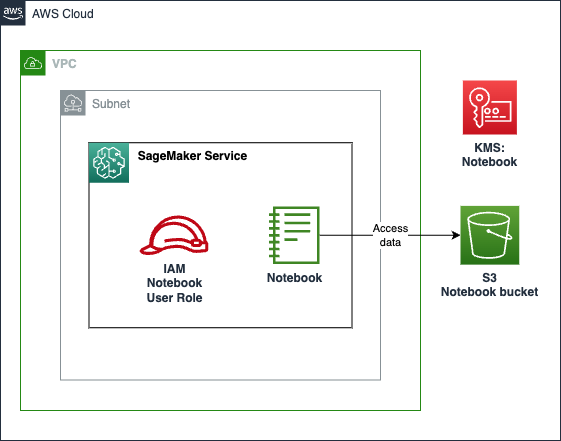

# AWS SageMaker Notebooks

Amazon SageMaker notebook instance is a machine learning (ML) compute instance running the Jupyter Notebook App. SageMaker manages creating the instance and related resources. Use Jupyter notebooks in your notebook instance to prepare and process data, write code to train models, deploy models to SageMaker hosting, and test or validate your models.

This module creates:

- **Notebook instance**: The notebook instance containing the Jupyter Notebook app that can be accessed using the AWS Console.
- **Notebook S3 bucket**: A dedicated S3 bucket is provisioned for the notebook instance to store temporary data. We recommend to provision a small instance volume (e.g., 5 GB) to save costs.
- **Notebook IAM Role**: IAM role that the notebook instance uses to access the dedicated S3 bucket for the SageMaker Notebook and any other S3 buckets that are specified in a Terraform variable.
- **KMS key**: KMS key used to encrypt data in the SageMaker Notebook instance.

## Architecture



## How to use this module

```terraform
module "notebook-johnsmith" {
  source = "/path/to/this/module/aws-sagemakernotebook"

  user_name = "johnsmith"

  notebook_instance_type      = "ml.m5.xlarge"
  notebook_volume_size        = 50
  network_info = {
    vpc_id = "vpc-1234567890"
    subnet_id = "subnet-1234567890"
  }

  notebook_policy_arns = {
    "data_bucket" = module.data_bucket.consumer_policy_arn
  }

  tags = local.tags
}
```

<!-- BEGIN_TF_DOCS -->
## Requirements

| Name | Version |
|------|---------|
| <a name="requirement_terraform"></a> [terraform](#requirement\_terraform) | >= 0.13 |
| <a name="requirement_aws"></a> [aws](#requirement\_aws) | ~> 5.45.0 |
| <a name="requirement_random"></a> [random](#requirement\_random) | >= 2.3.0 |

## Providers

| Name | Version |
|------|---------|
| <a name="provider_aws"></a> [aws](#provider\_aws) | ~> 5.45.0 |

## Modules

| Name | Source | Version |
|------|--------|---------|
| <a name="module_notebook_bucket"></a> [notebook\_bucket](#module\_notebook\_bucket) | ../aws-s3bucket | n/a |
| <a name="module_notebook_kms_key"></a> [notebook\_kms\_key](#module\_notebook\_kms\_key) | ../aws-kmskey | n/a |
| <a name="module_notebook_sg"></a> [notebook\_sg](#module\_notebook\_sg) | ../aws-sg | n/a |

## Resources

| Name | Type |
|------|------|
| [aws_iam_role.notebook_role](https://registry.terraform.io/providers/hashicorp/aws/latest/docs/resources/iam_role) | resource |
| [aws_iam_role_policy.notebook_bucket_access](https://registry.terraform.io/providers/hashicorp/aws/latest/docs/resources/iam_role_policy) | resource |
| [aws_iam_role_policy_attachment.additional](https://registry.terraform.io/providers/hashicorp/aws/latest/docs/resources/iam_role_policy_attachment) | resource |
| [aws_sagemaker_notebook_instance.notebook_instance](https://registry.terraform.io/providers/hashicorp/aws/latest/docs/resources/sagemaker_notebook_instance) | resource |
| [aws_caller_identity.main](https://registry.terraform.io/providers/hashicorp/aws/latest/docs/data-sources/caller_identity) | data source |
| [aws_iam_policy_document.notebook_role](https://registry.terraform.io/providers/hashicorp/aws/latest/docs/data-sources/iam_policy_document) | data source |
| [aws_region.active](https://registry.terraform.io/providers/hashicorp/aws/latest/docs/data-sources/region) | data source |

## Inputs

| Name | Description | Type | Default | Required |
|------|-------------|------|---------|:--------:|
| <a name="input_network_info"></a> [network\_info](#input\_network\_info) | Network information for the SageMaker Notebook. | <pre>object({<br>    vpc_id    = string<br>    subnet_id = string<br>  })</pre> | n/a | yes |
| <a name="input_notebook_instance_type"></a> [notebook\_instance\_type](#input\_notebook\_instance\_type) | The instance type of the notebook. | `string` | `"ml.t2.medium"` | no |
| <a name="input_notebook_policy_arns"></a> [notebook\_policy\_arns](#input\_notebook\_policy\_arns) | Policy ARNs to be attached to notebook role <br>that will be invoked for its target.<br>Map key is logical policy name and value is policy ARN. <br>e.g {<logical\_policy\_name>: <policyARN>} | `map(string)` | `{}` | no |
| <a name="input_notebook_volume_size"></a> [notebook\_volume\_size](#input\_notebook\_volume\_size) | The instance volume (in GB) of the notebook. | `number` | `20` | no |
| <a name="input_tags"></a> [tags](#input\_tags) | Custom tags which can be passed on to the AWS resources. They should be key value pairs having distinct keys. | `map(any)` | `{}` | no |
| <a name="input_user_name"></a> [user\_name](#input\_user\_name) | The name of the user that will be using the notebook. | `string` | n/a | yes |

## Outputs

| Name | Description |
|------|-------------|
| <a name="output_notebook_bucket_arn"></a> [notebook\_bucket\_arn](#output\_notebook\_bucket\_arn) | The ARN of the S3 bucket associated with the notebook |
| <a name="output_notebook_bucket_id"></a> [notebook\_bucket\_id](#output\_notebook\_bucket\_id) | The ID of the S3 bucket associated with the notebook |
| <a name="output_notebook_bucket_name"></a> [notebook\_bucket\_name](#output\_notebook\_bucket\_name) | The name of the S3 bucket associated with the notebook |
| <a name="output_notebook_instance_arn"></a> [notebook\_instance\_arn](#output\_notebook\_instance\_arn) | The ARN of the SageMaker notebook instance |
| <a name="output_notebook_instance_id"></a> [notebook\_instance\_id](#output\_notebook\_instance\_id) | The ID of the SageMaker notebook instance |
| <a name="output_notebook_instance_url"></a> [notebook\_instance\_url](#output\_notebook\_instance\_url) | The URL of the SageMaker notebook instance |
| <a name="output_notebook_kms_key_arn"></a> [notebook\_kms\_key\_arn](#output\_notebook\_kms\_key\_arn) | The ARN of the KMS key used for the notebook |
| <a name="output_notebook_kms_key_id"></a> [notebook\_kms\_key\_id](#output\_notebook\_kms\_key\_id) | The ID of the KMS key used for the notebook |
| <a name="output_notebook_security_group_arn"></a> [notebook\_security\_group\_arn](#output\_notebook\_security\_group\_arn) | The ARN of the security group associated with the notebook |
| <a name="output_notebook_security_group_id"></a> [notebook\_security\_group\_id](#output\_notebook\_security\_group\_id) | The ID of the security group associated with the notebook |
| <a name="output_notebook_security_group_name"></a> [notebook\_security\_group\_name](#output\_notebook\_security\_group\_name) | The name of the security group associated with the notebook |
| <a name="output_notebook_user_role_arn"></a> [notebook\_user\_role\_arn](#output\_notebook\_user\_role\_arn) | The ARN of the IAM role associated with the notebook user |
<!-- END_TF_DOCS -->